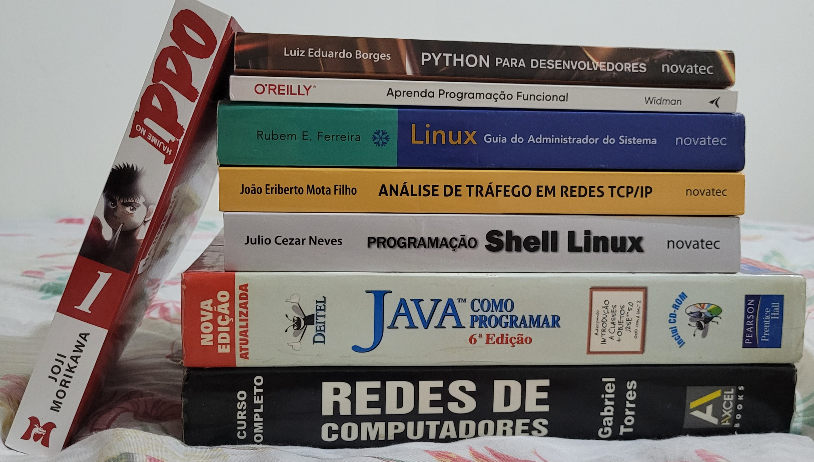

  

  

---

**Hello! My name is** `Carlos G. Baratieri`

> I am 22 years old, I have a degree in Technologist in Information Security (FATEC Ourinhos), I am currently pursuing a Bachelor’s degree in Computer Engineering (UTFPR-CP), and I am interested in computer networks, algorithms, data structures, and back-end development.

> Below is some of my literature (physical books)

  <table align="center">
    <tr>
      <td></td>
      <td></td>
    </tr>
  </table>

---

  
<b><code>Hard Skills</code></b>

  

    
<b>Languages</b>

    
<b>Programming</b>

    

      
      
      
      
    

    
<b>Markup</b>

    

      
      
    

    
<b>Scripting</b>

    

      
      
    

  

  

    
<b>Databases</b>

    

      
      
      
    

  

  

    
<b>OS & Networking</b>

    

      
      
      
      
      
    

  

---

  
<b><code>Contacts</code></b>

  

    
    
    
  

---

  
<b><code>UTFPR Announcements & Opportunities</code></b>

  
> Fui monitor da disciplina de Algoritmos 1 no primeiro semestre de 2025 e, em 2026, fui aprovado em um edital para trabalhar no Laboratório e Centro de Computação Científica e Tecnológica (CCCT-CP). Na Fatec, realizei um estágio com pouca alinhamento de plano trabalhista, mas o principal foi a criação de desafios (CTFs) para a Semana da Segurança da Informação.
  
- [Seleção 2025/1 de Estudantes Monitores - UTFPR](https://www.utfpr.edu.br/editais/graduacao-e-educacao-profissional/cornelioprocopio/selecao-2025-1-de-estudantes-monitores-de-atendimento-ao-estudante-mat-e-apoio-ao-docente-map-da-utfpr-do-campus-cornelio-procopio)
- [Laboratório Multiusuário CCCT-CP - UTFPR](https://www.utfpr.edu.br/editais/pesquisa-e-pos-graduacao/laboratorios-multiusuarios/ccct-cp/bolsista_nivel_medio_2025)

---

  

---

  

